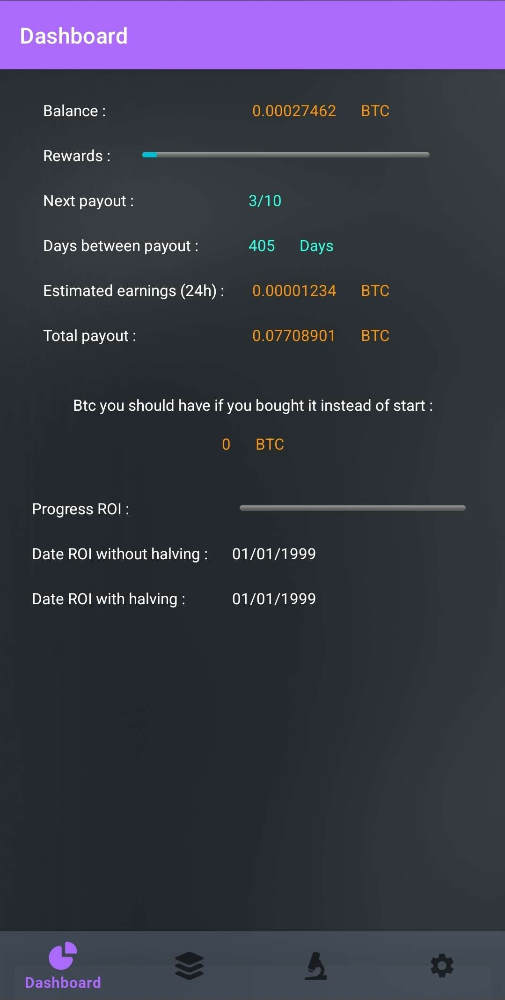
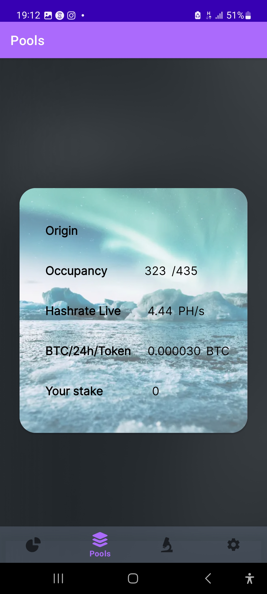
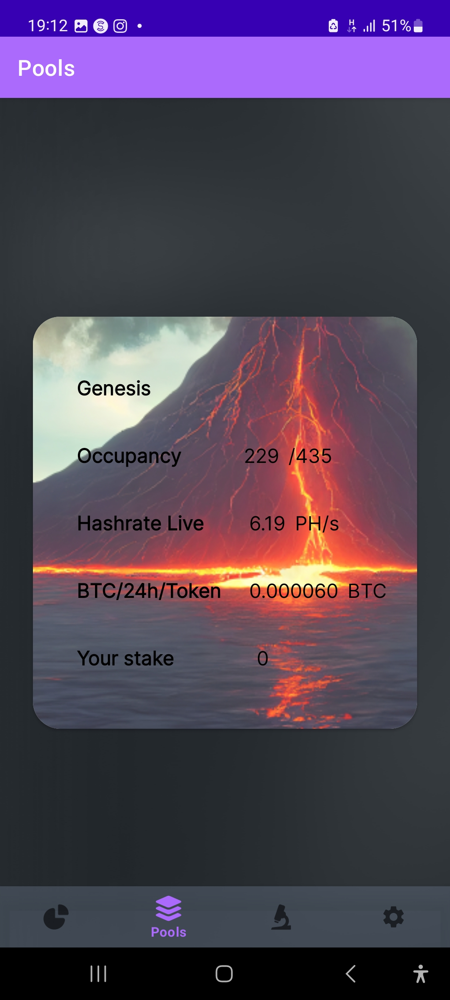
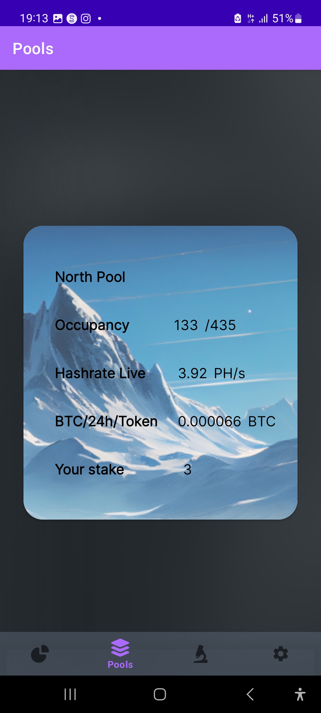

# Unofficial StartMining App
This App allowed you tu monitor your reward simply by putting your bitcoin and ethereum address.
This App is only available on Android.

## Compiling with Android Studio
Install Android Studio.
Open the directory as Project.
You can test it on a virtual device or your own.

## Views

### Dashboard

### Pools
  

### Options

