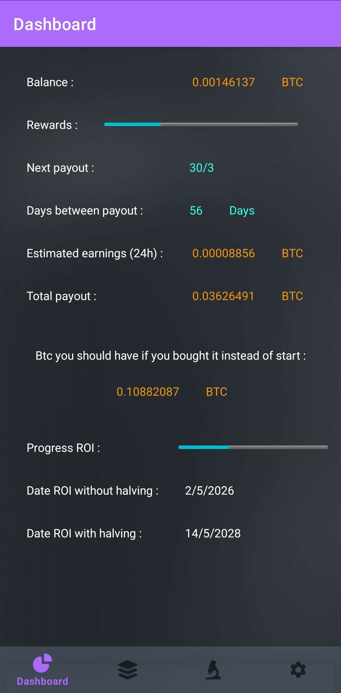

# Unofficial StartMining App
This App allowed you tu monitor your reward simply by putting your bitcoin and ethereum address.
This App is only available on Android.

## How to insatall
### 1 - Install Android Studio
Just google it you will find it pretty easy.

### 2 - Download the Project
You can download it on github as a zip a file.
Then extract the App.

### 3 - Open the App using Android Studio
Open Android Studio in File -> New -> Import Project and choose the decompressed folder.

### 4 - Install an emulator
If you have an Android Device you can skip this part.
To install an emulator to try the App you can follow this [video](https://www.youtube.com/watch?v=GhuiNcOEv1A).
## Be carefull !! To be sure that the App is running choose the API 34 when installing the emulator

### 5 - Test the App on real device
Follow this [video](https://www.youtube.com/watch?v=Wp6KbJcnxGU&t=27s) to add a real device to Android Studio.

## Views

### Dashboard

### Pools
  

### Options

